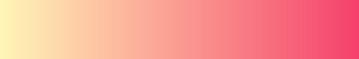
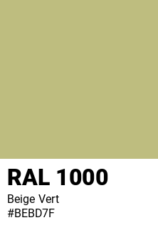

# Color-Programming
Programming Examples

__- GeneratingRandomColor_in_RGB ()__

__- GeneratingRandomColor_in_Hexadecimal ()__

__- GenerateListRandomColors_in_RGB ( number )__

__- GenerateListRandomColors_in_Hexadecimal ( number )__

__- LinearGradientHex ( start, end = "#FFFFFF", n = 10 )__

    LinearGradients_and_LinearInterpolation.py
    GenerateGradientColors.py

__- ImageSplit_to_RGB.py__

## RAL Classic

__- ral_classic_to_png.py__

